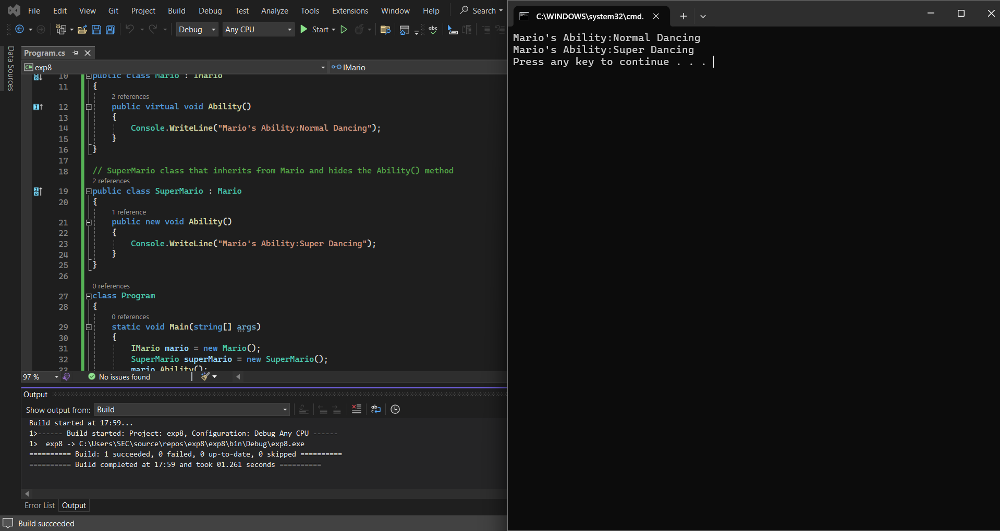

# 19AI308-Object-Oriented-Programming-using-CSharp--Exp-8-Name-Hiding-with-interface-inheritance
## AIM :
To implement name hiding with interface inheritance. Aim is to create an interface IMario with a method Ability(). 
Implement this interface in a class Mario and override the Ability() method also to create another class SuperMario that inherits from Mario 
and hides the Ability() method using the new keyword.

## PROGRAM:
```C#
DEVELOPED BY : JAYABHARATHI S
REG NO : 212222100013
```

```C#
using System;

// Define the IMario interface
public interface IMario
{
    void Ability();
}

// Implement the IMario interface in the Mario class
public class Mario : IMario
{
    public virtual void Ability()
    {
        Console.WriteLine("Mario's Ability:Normal Dancing");
    }
}

// SuperMario class that inherits from Mario and hides the Ability() method
public class SuperMario : Mario
{
    public new void Ability()
    {
        Console.WriteLine("Mario's Ability:Super Dancing");
    }
}

class Program
{
    static void Main(string[] args)
    {
        IMario mario=new Mario();
        SuperMario superMario=new SuperMario();
        mario.Ability();
        superMario.Ability();

       
    }
}

```
## OUTPUT:


## RESULT:
Thus, the program has been executed successfully.
